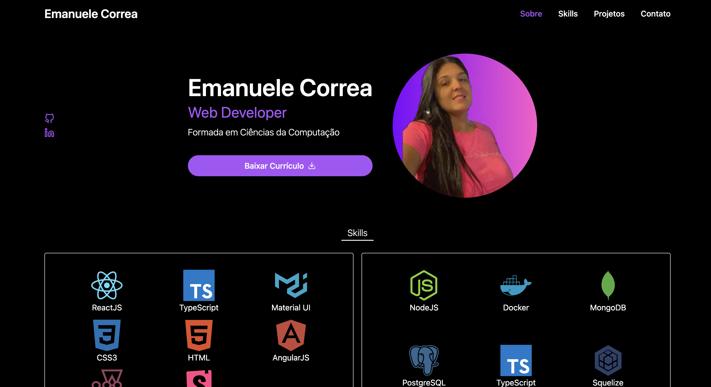

# Portfolio Emanuele Correa



## Tecnologias Utilizadas

- TypeScript
- Next.js
- React.js
- TailwindCSS

## 📦 Instalação

1. Clone o repositório:

```bash
git https://github.com/manuncorrea/portfolio-manu
cd portfolio-manu
```
2. Instale as dependências:

```bash
npm install
```
1. inicie o servidor:

```bash
npm install
npm run dev
```
